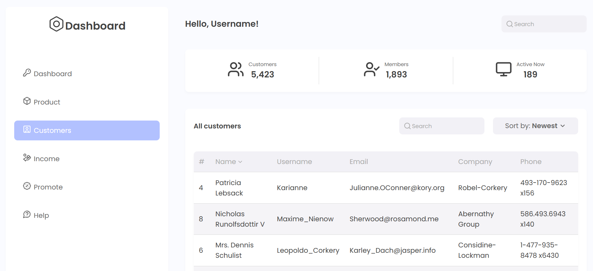

# CRM Dashboard

CRM дашборд с возможностью сортировки таблицы. UI kit для использования в разных проектах

## Deployment & Live Demo

[Deploy](https://tatyanazakiryanova.github.io/crm-dashboard/)



## Technologies Used

- Typescript
- React
- SCSS (Sass)
- Lucide React
- Vite
- ESLint, Prettier

## Features

- UI kit (button, dropdown, input, section, table, block)
- Таблица:
  - Сортировка по колонкам по клику
  - Сортировка через dropdown
  - Поиск по таблице
- Адаптив меню для экранов < 430px

Идея макета: https://www.figma.com/community/file/1146467298668328949

## How to start project

in the project directory enter:

```js
npm install
```

and then run in dev mode:

```js
npm run dev
```

build the project:

```js
npm run build
```
